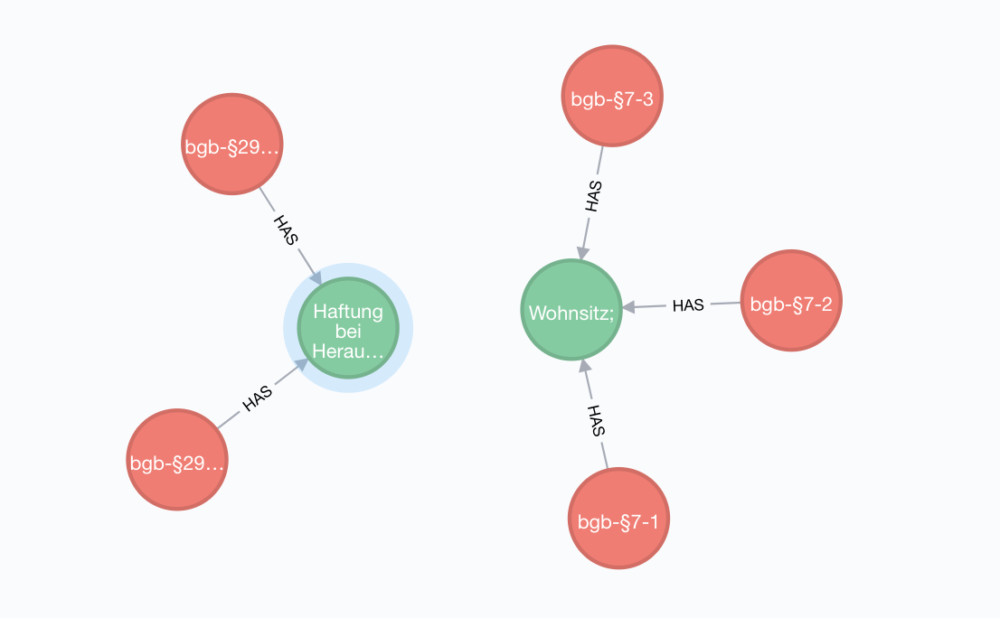

# Law-Service

This project is about the extraction from laws into a database. The project consists of two components:

* API - A REST API to access the data
* DB - A Neo4j database to store the graph structure
* Crawler - A software component to scrape data from a website

## Getting started

To get started just follow the next steps:

1. `pip install '.[test]'`
1. `python main.py`

## Testing
To test the application follow the next steps:

1. `docker-compose up -d`
1. `python setup.py test`

## Deployment 

Just create a new git tag via Github or git.

## Licence 

Apache 2.0 Licence